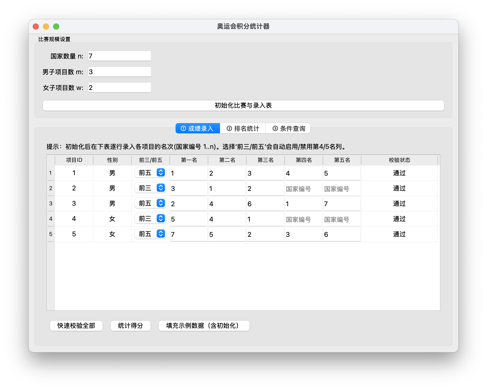
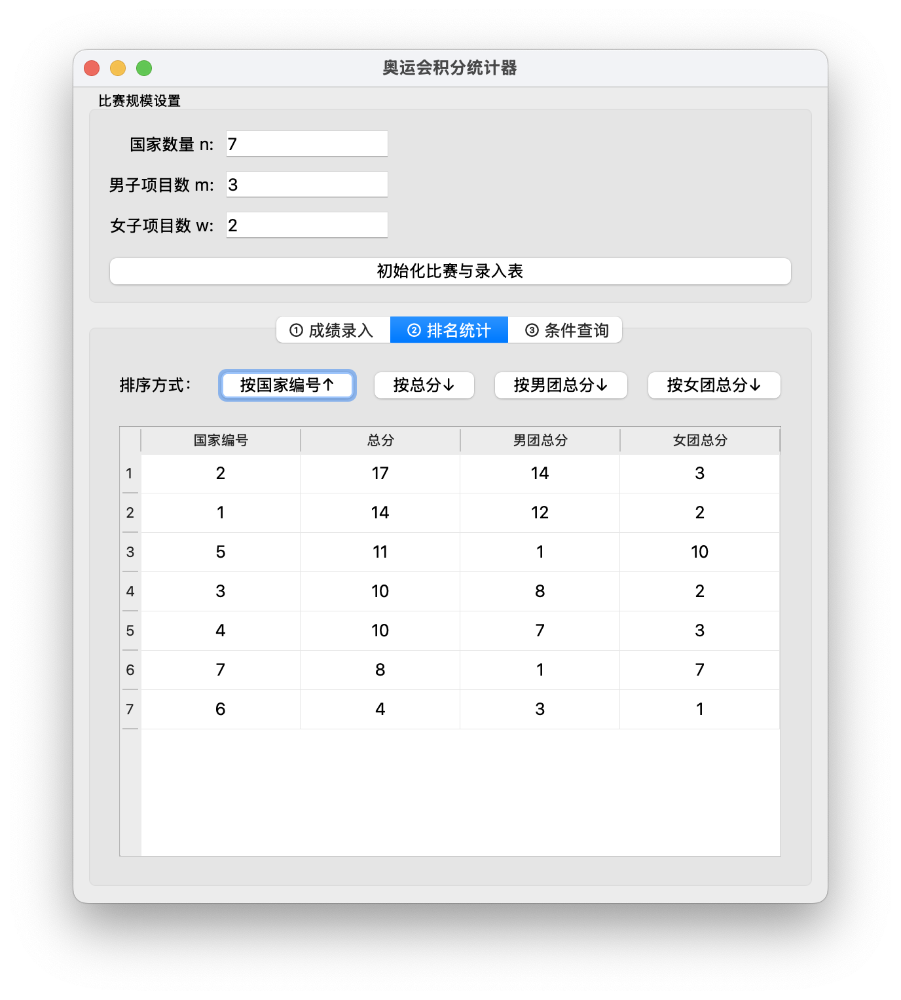
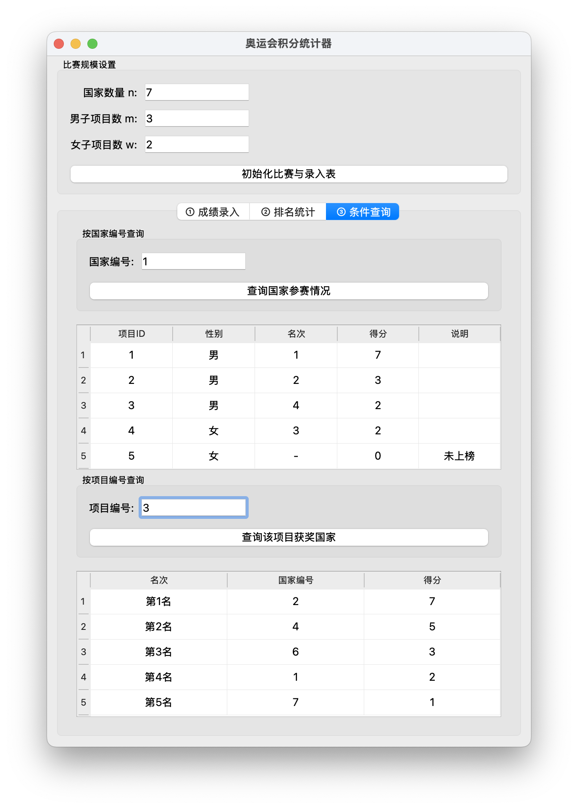

# olympic_scoring
Olympic scoring Simulator/Calculator written in Python + PyQt5



## Compilation

Use **Python 3.9+** to compile `olympic_scoring.py`, **PyQt5** required.

```bash
brew install python3.10
pip install pyqt5
```

```bash
python olympic_scoring.py
```

EXE files are made with `PyInstaller`:
```bash
pip install pyinstaller
pyinstaller -F olympic_scoring.py
```



